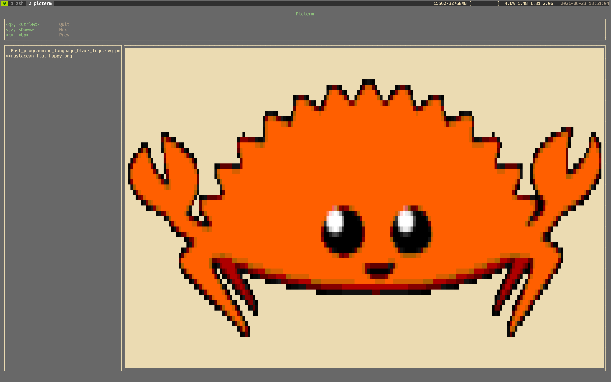

# Picterm

TUI image viewer



## install
```bash
$ git clone https://github.com/ksk001100/picterm
$ cd picterm
$ cargo install --path .
```

## usage
```bash
$ picterm # => Current directory
$ picterm ./
$ picterm $HOME/Downloads/
```